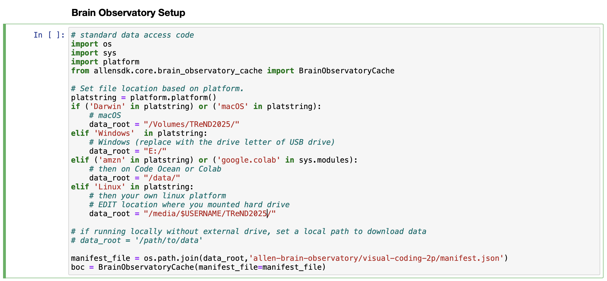

## Teaching topics

Allen Tutorial
- Allen datasets handling
- Plotting and basic analysis
- Decoding neural responses with scikit-learn

How to access data for the Allen Brain Observatory and Allen Institute tutorials.

1.  Colab

	We’ve set up the notebooks so that you can open them on Colab and they will access data directly from the publicly available AWS sources.  

	When creating a notebook for a project, if you use Colab, then you will need to copy the initial cell from one of our notebooks and include it at the top.  This cell looks like:

This cell installs the allensdk and mounts the necessary data for the python environment associated with the Colab notebook.  Importantly, the kernel will need to restart, which is why the “exit()” command is at the end.  This will generate an error, but it should be safe to continue running the next cell.  It will NOT be necessary to repeat this cell when using the same runtime environment on Colab, although it shouldn’t harm anything to do so.

2.  Hard Drives with Allen Institute data

	We’ve provided hard drives that are yours to keep.  These drives contain a portion of the Allen Institute Visual Coding 2P data set.  We’ve included a cell in our notebooks that will mount data from the appropriate location regardless of whether you are using Colab, or running a Jupyter notebook locally on your laptop.  This cell looks like:

The important thing this cell does is set the “manifest_file” variable to point to the “manifest.json” file.  You *may* need to alter the “data_root” variable if you are on Windows or Linux, depending on how the hard drive is mounted.  For macOS and Colab this cell will *probably* work as written.  

	Importantly, you will need to set up a conda environment that has the appropriate versions of python, numpy, the allensdk, and other software.  Simply pip installing these packages will not work.  We have provided a file ‘environment.yml’ that should work.  You can set up this environment with the following conda command:

	conda env create -f environment.yml -n trend2025

	and then you can activate this environment with the following command:

	conda activate trend2025

	You should now be able to run the notebooks locally.

3.  Allen Institute data copied locally to your laptop

	
	If necessary, we have just the subset of the data that is being used in the tutorials available to be copied onto your laptop.  The instructors will provide this data for you.  It will be in a folder called ‘allen_brain_observatory’.  

	The setup is nearly identical to #2 above.  The difference is where the ‘manifest_file’ variable points.  Set ‘data_root’ to point to the location of ‘allen_brain_observatory’.

	data_root = /path/to/allen_brain_observatory

	and then copy the last two lines of the cell above in #2.

	manifest_file = os.path.join(data_root,'allen-brain-observatory/visual-coding-2p/manifest.json')
	boc = BrainObservatoryCache(manifest_file=manifest_file)

4.  Downloading Allen Institute data. - NOT RECOMMENDED

	If necessary, you can download any data you need yourself.  To do this, assign ‘manifest_file’ to a location you want ‘manifest.json’ to be and then use the last line of the cell above.

	boc = BrainObservatoryCache(manifest_file=manifest_file)

	When you request data, it will be downloaded to your local machine.  For most analyses this will be prohibitive and we do not recommend it.  
